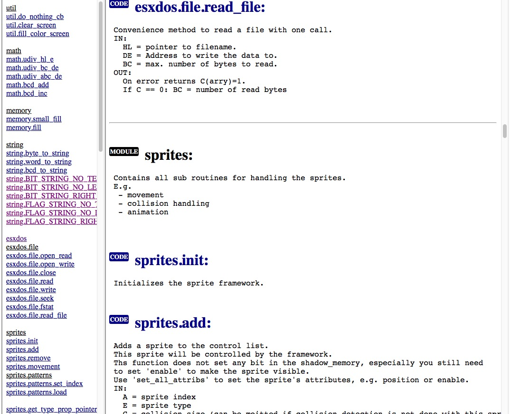

# API Documentation Tool for Assembler Files

This simple documentation tool for assembler files takes the comments above or next to the labels, extracts them and generates a html output which is easy to navigate.
You can decide which subroutines should be documented. Only labels from the labels file will be documented.

If you need a tool to create the documentation for your library you might find this little program helpful.

Please note: This tool was only tested with the sjasmplus syntax. It understands MODULE, STRUCT etc. Other assemblers have not been tested. They may or may not work.

# Features

- supports sjasmplus syntax ([sjasmplus](https://github.com/z00m128/sjasmplus) v1.11.0)
- uses sjasmplus EXPORT definition to select the labels to document
- creates documentation from comments inside the source code
- reads in the list file and the exported labels file (sjasmplus output)
- determines the type of the label, i.e. MODULE, CODE, DATA or EQU/CONST

# Installation

The program is written in typescript and can be built for Linux, Mac or Windows.

If you don't want to build you can use the prebuilt binaries from the releases.

Just unzip and run from the commandline.

# Usage

Please note:
The idea is to document a library for users of the library not for the maintainers.
I.e. you select the "public" labels that should be documented. All other labels will not appear.

The tool takes either the comments above the label as documentation or (with higher priority) the comment on the same line next to the label.

I.e. your documentation should look like:

~~~
   ; This module provides string manipulation routines.
   MODULE string

; This is a comment above a label. This is a sample description:
; Concatenates 2 strings and creates a new one.
; IN:
;  HL = pointer to 1rst string
;  DE = pointer to 2nd string
; OUT:
;  HL = pointer to new concatenated string
concatenate:
   ...

data:  ; Comments after a label are also allowed.
    defs 100

internal_data: ; Another comment which is not selected for output
    defb 0

  ENDMODULE 
~~~

Somewhere in your assembler file you need to EXPORT the labels you want to document.
E.g.:

~~~
    EXPORT string.concatenate
    EXPORT string.data
~~~

The documentation tool works with the list and label files created by sjasmplus.

You create those e.g. with (main.asm and main.list are just exemplary file names):

~~~
sjasmplus --lst=main.list --exp=export.labels main.asm
~~~

Make sure that your main.asm contains EXPORT statements.
Only labels with EXPORT statements will be output to 'export.labels'. And only those labels will be documented.

Alternatively you can also put all EXPORT statements in a single file (e.g. exports.asm) and add that to the sjasmplus command line.

~~~
sjasmplus --lst=main.list --exp=export.labels main.asm exports.asm
~~~

Once you generated the list file and the labels file you can use it as input to the doc tool.

~~~
./asm-api-doc-tool --list main.list --labels export.labels --out html
~~~

The command above will take the list file (main.list) and the labels file (export.labels) and create the directory 'html' which will contain the documentation html files.

To watch the html documentation simply point your browser to 'html/index.html'.

Notes:

- The 'stylesheet.css' inside 'html' allows further customization of the browser output.
- The order of the labels in the doc output depends on the order of the EXPORTs in the main.asm (or exports.asm) file.
- Use 'sjasmplus -h' to see all command line options.

# Example Output

